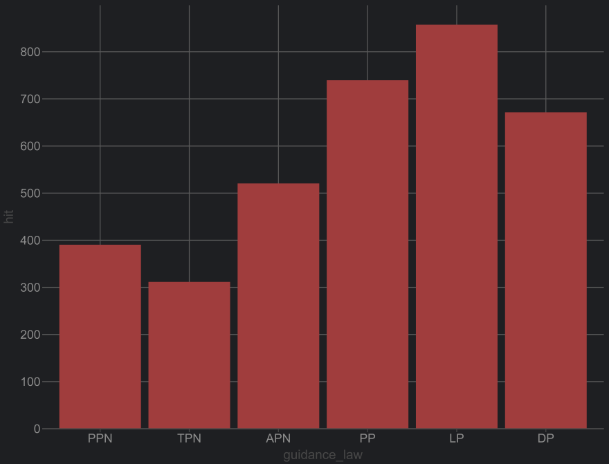
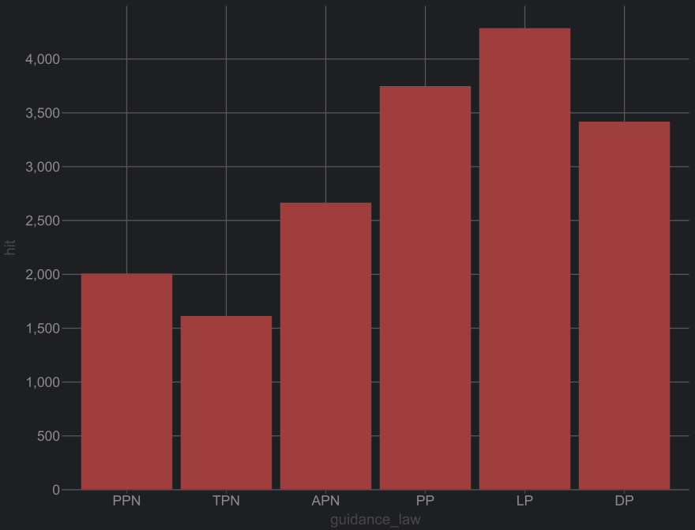

# Missile Guidance Simulation

A high-performance missile guidance system simulator supporting multiple guidance laws in 3D combat scenarios.
This tool enables exploration of proportional navigation dynamics through realistic simulations with 3D trajectory
plots, performance metrics, and machine learning dataset generation.

## Little Overview

- **Multiple Guidance Laws**: Supports PPN, TPN, APN, Pure Pursuit (PP), Deviated Pursuit (DP), and Lead Pursuit (LP)
- **Diverse Scenarios**: Includes perpendicular-intercept, side-intercept, air strikes, and ground launch scenarios
- **High-Fidelity Physics**: Uses simple kinematics with configurable missile and target parameters
- **Parallel Processing**: Utilizes Rayon for parallel simulation execution and burns your CPU cores
- **Visualization**: Generates trajectory plots and metric charts using Plotters
- **Extensible Architecture**: Easy to add new guidance laws, scenarios, or renderers

## Guidance Laws

This simulator implements six different guidance laws:

- **Pure Proportional Navigation (PPN)**: Classical guidance using line-of-sight rate
    - `a_c = N × V_m × λ̇`
    - N = Navigation constant (typically 3-5)

- **True Proportional Navigation (TPN)**: Accounts for closing speed in addition to LOS rate
    - `a_c = N × V_c × λ̇`
    - V_c = Closing velocity

- **Augmented Proportional Navigation (APN)**: Adds target acceleration compensation
    - `a_c = N × V_c × λ̇ + (N/2) × a_t`
    - a_t = Target acceleration (estimated)

- **Pure Pursuit (PP)**: Aims directly at target's current position
    - Simple pursuit strategy, often inefficient against maneuvering targets

- **Deviated Pursuit (DP)**: Pursuit with deviation angle correction
    - Improved pursuit with angular correction

- **Lead Pursuit (LP)**: Aims ahead of target with configurable lead factor
    - `a_c = K × (target_predicted_pos - missile_pos)`
    - K = Lead factor

See [HOMING_MATHS.md](docs/HOMING_MATHS.md) for detailed mathematical derivations.

## Binaries

### 1. CLI Tool (ms)

Interactive command-line interface for running custom scenarios:

```shell

    (x0, y0, z0)
     ●  •  •  •  •  •  • .
                           •
    ▄▄▄      ▄▄▄  ▄▄▄▄▄▄▄    •
    ████▄  ▄████ █████▀▀▀     •
    ███▀████▀███  ▀████▄       •
    ███  ▀▀  ███    ▀████      •
    ███      ███ ███████▀     •
                            •
    ● • • • • • • • • • • X
    (x1, y1, z1)          (x2, y2, z2)

```

Run a custom scenario with specific parameters:

```shell
cargo run --bin ms --release -- run \
  --m-x 500.0 --m-y 0.0 --m-z 0.0 \
  --m-vx 0.0 --m-vy 1250.0 --m-vz 0.0 \
  --m-a-max 1500.0 --m-n 5.0 --m-v-closing-max 8000.0 \
  --t-x -5000.0 --t-y 2000.0 --t-z 0.0 \
  --t-vx 1200.0 --t-vy 0.0 --t-vz 0.0 \
  --dt 0.0001 --total-time 30.0
```

The CLI supports:

- Custom missile configuration (position, velocity, max acceleration, navigation constant)
- Custom target configuration (position, velocity)
- Configurable simulation parameters (timestep, duration, Navigation constant)
- Tests with PPN, TPN, and APN guidance laws, the base ones
- Parallel execution using Rayon

### 2. Plot Generator

Generate trajectory and metric plots for preset scenarios:

```shell
cargo run --bin plot --release
```

This binary simulates all preset scenarios with multiple guidance laws, printing progress to the console and
saving plots to the `plots/` directory.

**Supported Guidance Laws:**

- Pure Proportional Navigation (PPN)
- True Proportional Navigation (TPN)
- Augmented Proportional Navigation (APN)
- Pure Pursuit (PP)
- Deviated Pursuit (DP)
- Lead Pursuit (LP)

Output structure:

- `plots/trajectories/{scenario}/{law}_trajectory.png` - 3D trajectory plots
- `plots/metrics/{scenario}/{law}_*.png` - Metric charts (closing velocity, lateral acceleration, LOS rate, etc.)

You can modify preset scenarios in `src/scenarios/presets.rs`. For high-speed missiles, consider setting dt to
`0.00001` (100kHz update rate).

Console output example:

```bash
Scenario: Perpendicular-Intercept | Guidance: LP
Travel Duration: 2.60 | Miss Distance: 9.99 | Hit: 1

Scenario: Perpendicular-Intercept | Guidance: TPN
Travel Duration: 2.63 | Miss Distance: 9.98 | Hit: 1

Scenario: Perpendicular-Intercept | Guidance: PPN
Travel Duration: 2.68 | Miss Distance: 9.98 | Hit: 1

Scenario: Perpendicular-Intercept | Guidance: APN
Travel Duration: 3.50 | Miss Distance: 9.99 | Hit: 1

Scenario: Side-Intercept | Guidance: LP
Travel Duration: 4.38 | Miss Distance: 9.99 | Hit: 1

Scenario: Side-Intercept | Guidance: PPN
Travel Duration: 4.67 | Miss Distance: 9.99 | Hit: 1

Scenario: Air-Strike | Guidance: APN
Travel Duration: 5.10 | Miss Distance: 9.98 | Hit: 1

Scenario: Air-Strike | Guidance: LP
Travel Duration: 5.17 | Miss Distance: 9.98 | Hit: 1

Scenario: Air-Strike | Guidance: TPN
Travel Duration: 5.17 | Miss Distance: 9.99 | Hit: 1

Scenario: Side-Intercept | Guidance: TPN
Travel Duration: 4.65 | Miss Distance: 9.98 | Hit: 1

Scenario: Ground-Launch-Strike | Guidance: APN
Travel Duration: 5.60 | Miss Distance: 10.00 | Hit: 1

Scenario: Side-Intercept | Guidance: APN
Travel Duration: 5.33 | Miss Distance: 9.99 | Hit: 1

Scenario: Ground-Launch-Strike | Guidance: PPN
Travel Duration: 6.17 | Miss Distance: 9.99 | Hit: 1

Scenario: Ground-Launch-Strike | Guidance: LP
Travel Duration: 6.11 | Miss Distance: 10.00 | Hit: 1

Scenario: Air-Strike | Guidance: PPN
Travel Duration: 5.17 | Miss Distance: 9.99 | Hit: 1

Scenario: Ground-Launch-Strike | Guidance: TPN
Travel Duration: 6.96 | Miss Distance: 10.00 | Hit: 1

Scenario: Ground-Launch-Strike | Guidance: PP
Travel Duration: 8.53 | Miss Distance: 10.00 | Hit: 1

Scenario: Ground-Launch-Strike | Guidance: DP
Travel Duration: 8.51 | Miss Distance: 10.00 | Hit: 1

Scenario: Air-Strike | Guidance: PP
Travel Duration: 10.65 | Miss Distance: 10.00 | Hit: 1

Scenario: Air-Strike | Guidance: DP
Travel Duration: 10.60 | Miss Distance: 9.99 | Hit: 1

Scenario: Side-Intercept | Guidance: PP
Travel Duration: 27.02 | Miss Distance: 10.00 | Hit: 1

Scenario: Side-Intercept | Guidance: DP
Travel Duration: 26.77 | Miss Distance: 10.00 | Hit: 1

Scenario: Perpendicular-Intercept | Guidance: PP
Travel Duration: 41.93 | Miss Distance: 10.00 | Hit: 1

Scenario: Perpendicular-Intercept | Guidance: DP
Travel Duration: 45.22 | Miss Distance: 10.00 | Hit: 1
```

### 3. Data Generator

Generate machine learning datasets with randomized scenarios:

```shell
cargo run --bin generate_data --release
```

This binary creates randomized scenarios and exports summary data for Data analysis and applications.

Default configuration:

- **Run count**: 100 scenarios
- **Timestep**: 0.0001s (10kHz update rate)
- **Duration**: 30 seconds per scenario
- **Guidance laws tested**: PPN, TPN, APN

Output files:

- `summary.csv` - Tabular format with scenario name, guidance law, duration, miss distance, hit status, and timesteps
- `summary.json` - JSON array format with the same data

Query successful hits:

```shell
rg ",1," summary.csv | wc -l
```

## Example Scenarios

### Preset Scenarios

```rust
async fn test_0() -> Result<Scenario> {
    ScenarioBuilder::new("Perpendicular-Intercept")
        .missile_config(MissileConfig {
            position: Vector3::new(500.0, 0.0, 0.0),
            velocity: Vector3::new(0.0, 1250.0, 0.0),
            max_acceleration: 1500.0,
            navigation_constant: 5.0,
            max_closing_speed: 8000.0,
        })
        .target_config(TargetConfig {
            position: Vector3::new(-5000.0, 2000.0, 0.0),
            velocity: Vector3::new(1200.0, 0.0, 0.0),
        })
        .dt(0.00001) // 100kHz update rate (1MHz simulation timestep)
        .total_time(60.0)
        .hit_threshold(10.0)
        .build()
}

```

### Scenarios plot


### Metrics plot


### Summary Metrics



- Out of 1000 random scenarios each, PPN achieved 389 hits, TPN 310 hits, and APN 519 hits, PP achieved 738 hits, DP 670
  hits, and LP 856 hits.
- WHOA, What the heck 🫡, LP is the best one! Who would have thought!
- TPN is doing worse than PPN, interesting, probably because of the large rate of change in closing velocity.



- Out of 5000 random scenarios each, PPN achieved 2000 hits, TPN 1606 hits, and APN 2648 hits, PP achieved 3741 hits,
  DP 3411 hits, and LP 4279 hits.
- Yep, LP still the best one by a good margin.
- Looks like the Pursuit family does better in random scenarios.

[!Hit_Statistics](Summary_10000.png)

- Out of 10000 random scenarios each, PPN achieved 4031 hits, TPN 3217 hits, and APN 5412 hits, PP achieved 7473 hits,
  DP 6835 hits, and LP 8552 hits.
- The trend continues, LP is the best guidance law in these random scenarios.
- Maybe because it leads the target, so it can handle maneuvers better?

## Data Export

The simulator exports summary data in two formats for machine learning applications:

### Summary Metadata Structure

```rust
#[derive(Serialize, Deserialize)]
pub struct SimulationMetadata {
    pub scenario_name: String,
    pub guidance_law: String,
    pub duration: f64,
    pub miss_distance: f64,
    pub hit: bool,
    pub timesteps: usize,
}
```

### Sample CSV Output

```csv
scenario,guidance_law,duration,miss_distance,hit,timesteps
random_0,PPN,12.45,4.23,1,124500
random_0,TPN,12.38,4.19,1,123800
random_0,APN,12.41,4.15,1,124100
random_1,PPN,8.92,3.87,1,89200
```

Modify generation logic in `src/scenarios/random_data.rs` to customize:

- Number of scenarios
- Random parameter ranges
- Simulation timestep and duration
- Output location

## Technical Details

### Performance Optimizations

- **SIMD Acceleration**: Uses the `wide` crate for SIMD-optimized vector operations
- **Parallel Execution**: Rayon-based parallelism for batch simulations (Arc and Mutex thingy for thread safety 😵‍💫 😵)
- **Zero-Copy Operations**: Efficient memory management with pre-allocated buffers


