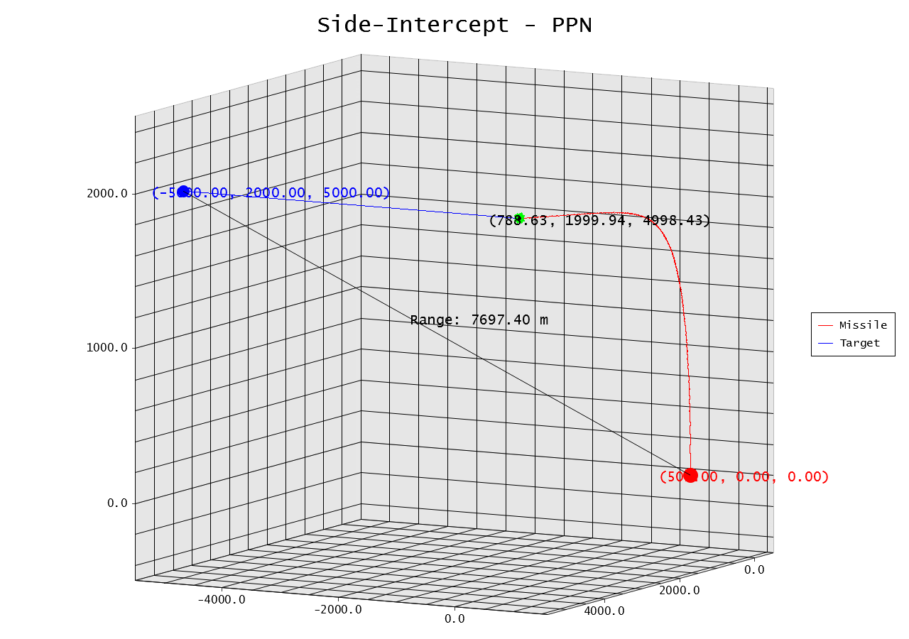
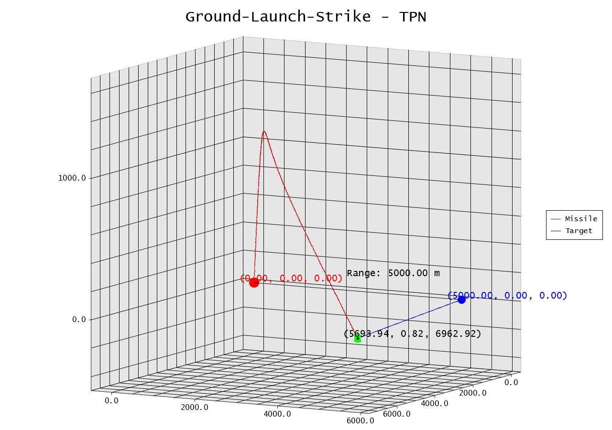
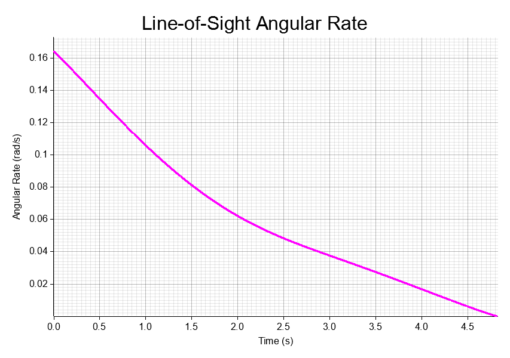
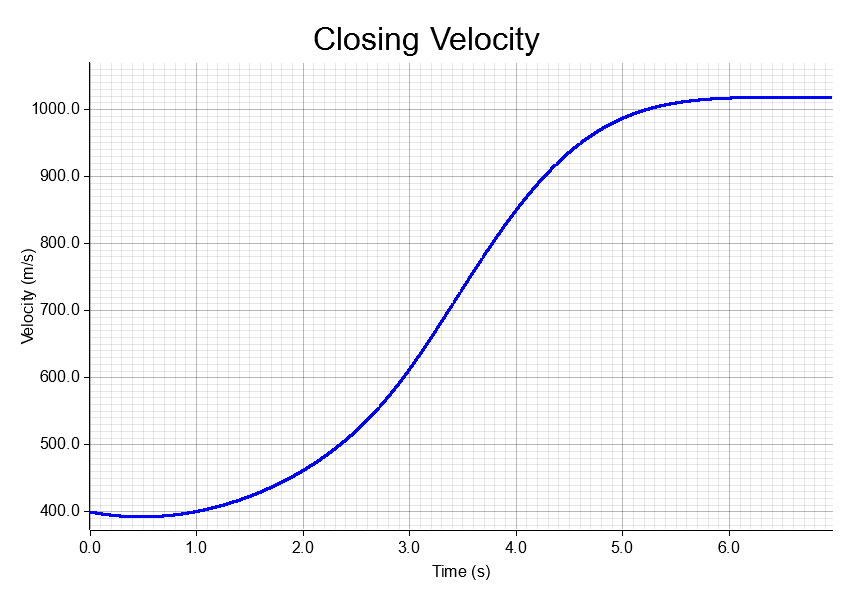

# Missile Simulation

A simple project that simulates missile guidance systems in various combat scenarios.
This tool helps you explore the dynamics of proportional navigation laws by running realistic simulations and
visualizing the results through 3D plots, performance metrics and generate data model training.

## Features

- **Multiple Guidance Laws**: Supports Pure Proportional Navigation (PPN) and True Proportional Navigation (TPN).
- **Diverse Scenarios**: Includes scenarios like head-on intercepts, tail chases, air strikes, and more.
- **Physics with Assumption**: Uses basic kinematics with configurable missile and target parameters.
- **Visualization**: Generates trajectory plots and metric charts using Plotters.
- **Train Data Generation**: Outputs data suitable for training machine learning models.
- **Extensible**: Easy to add new guidance laws, scenarios, or renderers.
- **Three separate binaries**: For Plotting, debugging and data generation.

## Prerequisites

- Rust
- Cargo
- Conda (for Notebooks)

## PLOTS

   ```shell
   cargo build
   cargo run --bin plot
   ```

- The [binary](src/bin/plot.rs) will simulate each scenario with both PPN and TPN, printing progress to the console and
  saving plots to the `plots/` directory.

- You add more preset scenarios or modify existing ones in the `src/scenarios/`
  directory, [Presets](src/scenarios/presets.rs), Consider setting the dt to `1000 hz ~ 0.0001s` from high speed
  missile,

- Hit feedback in console

```bash
 Scenario: Perpendicular-Intercept
    Testing PPN Travel Duration: 2.69 | Miss Distance: 4.77 | Hit: 1
    Testing TPN Travel Duration: 2.63 | Miss Distance: 4.78 | Hit: 1

 Scenario: Ground-Launch-Strike
    Testing PPN Travel Duration: 6.17 | Miss Distance: 4.93 | Hit: 1
    Testing TPN Travel Duration: 6.96 | Miss Distance: 4.97 | Hit: 1

 Scenario: Air-Strike
    Testing PPN Travel Duration: 4.21 | Miss Distance: 4.85 | Hit: 1
    Testing TPN Travel Duration: 4.24 | Miss Distance: 4.87 | Hit: 1

 Scenario: Side-Intercept
    Testing PPN Travel Duration: 4.82 | Miss Distance: 4.88 | Hit: 1
    Testing TPN Travel Duration: 4.80 | Miss Distance: 4.91 | Hit: 1
```

### Hardcoded Scenarios

```rust
pub fn load_preset_scenarios() -> Vec<Scenario> {
    vec![test_0(), test_1(), test_2(), test_3()]
}

fn test_0() -> Scenario {
    ScenarioBuilder::new("Perpendicular-Intercept")
        .missile_config(MissileConfig {
            position: Vector3::new(500.0, 0.0, 0.0),
            velocity: Vector3::new(0.0, 1250.0, 0.0),
            max_acceleration: 1500.0,
            navigation_constant: 5.0,
            max_closing_speed: 8000.0,
        })
        .target_config(TargetConfig {
            position: Vector3::new(-5000.0, 2000.0, 0.0),
            velocity: Vector3::new(1200.0, 0.0, 0.0),
        })
        .dt(0.0001) // 10000 Hz update rate
        .total_time(30.0)
        .hit_threshold(5.0)
        .build()
}

```

### Scenarios plot




### Metrics plot




### Guidance Laws

- **Pure Proportional Navigation (PPN)**: Uses `line-of-sight rate` for guidance.
- **True Proportional Navigation (TPN)**: Accounts for `closing speed` in addition to LOS rate.

## REAL-TIME DEBUG AND VISUAL

```shell
cargo build
cargo run --bin debug
```

- This [binary](src/bin/debug.rs) opens a window to simulate the loaded scenario in real-time showing velocity vectors,
  shortest path, trajectory and metrics in debug
  panel (USES RAYLIB)

- Real-Time Closing speed is helpful, because as it gets never -ve, the missile will never home toward the target

### Controls

- Key C: Change Camera Mode, ["Missile" or "Target"]

```rust
#[derive(Debug, Clone, Copy, PartialEq)]
enum CameraMode {
    Missile,
    Target,
    XY, //TODO
    XZ, //TODO
    YZ, //TODO

}
```

- Mouse Left: Controls Camera, free lock about the Target
-

```rust
// Camera settings
const CAM_SENSITIVITY: f32 = 0.005;
const CAM_ZOOM_SPEED: f32 = 50.0;
const CAM_PITCH_MIN: f32 = -1.5;
const CAM_PITCH_MAX: f32 = 1.5;
const CAM_DISTANCE_MIN: f32 = 100.0;
const CAM_DISTANCE_MAX: f32 = 5000.0;
const CAM_DEFAULT_DISTANCE: f32 = 500.0;
const CAM_DEFAULT_YAW: f32 = 0.0;
const CAM_DEFAULT_PITCH: f32 = 0.5;
```

- Key T: Change guidance logic, ["PPN" or "TPN"]

```rust
#[derive(Debug, Clone, Copy, PartialEq)]
enum GuidanceType {
    PureChase, //TODO
    PurePN,
    TruePN,
    AugmentedPN, //TODO
}
```

### Little Debug Demo


## DATA GEN

-This [binary](src/bin/generate_data.rs) will generate nth dataset with about 10 features+ for model trainings.

- You add more or modify existing generation logic in the `src/scenarios/`
  directory, [Data](src/scenarios/train_data.rs),

```rust
pub fn load_train_data() -> Vec<Scenario> {
    let mut scenarios = Vec::new();

    for seed in 0..200 {
        scenarios.push(generate_random_scenario(seed));
    }

    scenarios
}
```

- Data summary is also generated, give hit feedback and other info about all scenario generated

```shell
rg ",1," data/summary.csv | wc -l
```

- Data sets, and summary are saved as CSV and JSON in the `data/` directory for each scenario and guidance law.

### Extracted Data Point

```rust
#[derive(Serialize, Deserialize)]
pub struct SimulationDataPoint {
    pub time: f64,
    pub missile_x: f64,
    pub missile_y: f64,
    pub missile_z: f64,
    pub missile_vx: f64,
    pub missile_vy: f64,
    pub missile_vz: f64,
    pub target_x: f64,
    pub target_y: f64,
    pub target_z: f64,
    pub target_vx: f64,
    pub target_vy: f64,
    pub target_vz: f64,
    pub distance: f64,
    pub acceleration: f64,
    pub los_rate: f64,

    /// Closing speed (rate of range decrease) - recorded for all guidance laws
    /// for analysis purposes. Used directly by TPN, recorded for PPN comparison.
    pub closing_speed: f64,
    pub hit: bool,
}
```

Sample CSV

```csv
time,missile_x,missile_y,missile_z,missile_vx,missile_vy,missile_vz,target_x,target_y,target_z,target_vx,target_vy,target_vz,distance,acceleration,los_rate,closing_speed,hit
0,924.4536634548181,2433.650460883095,-1896.6214630665804,-131.9474980288427,481.70098016178787,1722.1082199140278,2153.316025960237,2373.3460727481825,-6257.671352754478,1428.235486694958,-314.03209977931226,-33.05345822773355,4531.279671964373,0,0.28271598427137545,-2122.928771626081,0
0.0001,924.4404781229246,2433.6986236429743,-1896.449249470398,-131.85331893555048,481.62759879426744,1722.1359618246895,2153.4588495089065,2373.3146695382047,-6257.674658100301,1428.235486694958,-314.03209977931226,-33.05345822773355,4531.491966670209,1225.7299996196357,0.2826624472662804,-2122.965162088819,0
0.0002,924.4273022089315,2433.746779064408,-1896.2770331008112,-131.75913993135254,481.55421433864404,1722.1636958680444,2153.601673057576,2373.283266328227,-6257.677963446124,1428.235486694958,-314.03209977931226,-33.05345822773355,4531.704265013386,1225.7299996196357,0.2826089173274708,-2123.001529480879,0
0.00030000000000000003,924.4141357128298,2433.794927147088,-1896.1048139586069,-131.6649610163498,481.48082679567824,1722.191422043872,2153.744496606246,2373.2518631182493,-6257.681268791946,1428.235486694958,-314.03209977931226,-33.05345822773355,4531.9165669915965,1225.7299996196357,0.2825553944543698,-2123.
```

# Hire me EA 🥲🙏
