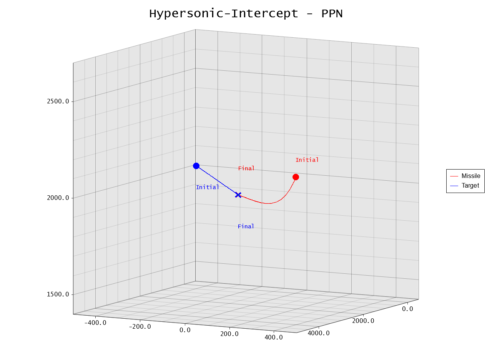
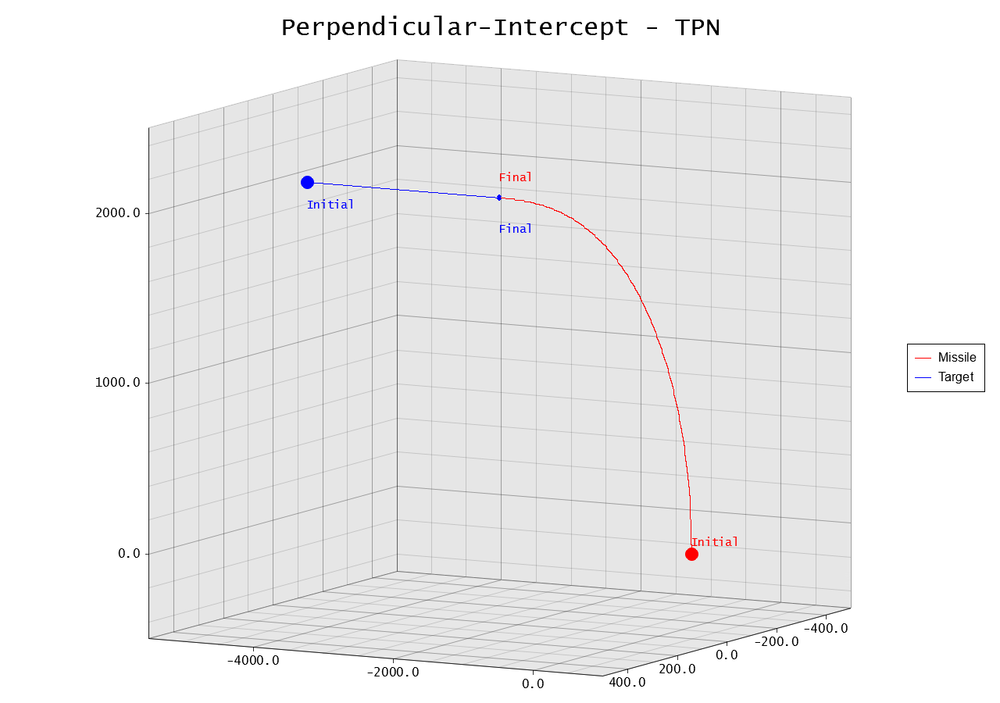

# Missile Simulation

A simple project that simulates missile guidance systems in various combat scenarios.
This tool helps you explore the dynamics of proportional navigation laws by running realistic simulations and
visualizing the results through 3D plots, performance metrics and generate data model training.

## Features

- **Multiple Guidance Laws**: Supports Pure Proportional Navigation (PPN) and True Proportional Navigation (TPN).
- **Diverse Scenarios**: Includes scenarios like head-on intercepts, tail chases, air strikes, and more.
- **Physics without Assumption**: Uses basic kinematics with configurable missile and target parameters.
- **Visualization**: Generates stunning trajectory plots and metric charts using Plotters.
- **Extensible**: Easy to add new guidance laws, scenarios, or renderers.

## Prerequisites

- Rust (edition 2024 or later)
- Cargo (Rust's package manager)

## Testing the Simulation

   ```bash
   git clone https://github.com/yourusername/missile-sim.git
   cd missile-sim
   cargo build --release
   cargo run --release
   ```

- You add more preset scenarios or modify existing ones in the `src/scenarios/`
  directory, [Presets](src/scenarios/presets.rs), Consider setting the dt to `1000 hz ~ 0.0001s` from high speed
  missile,

- The program will simulate each scenario with both PPN and TPN, printing progress to the console and saving plots to
  the
  `plots/` directory.

## Demo Scenarios

The simulation includes several preset scenarios, each with unique missile and target configurations:




### Predefined Scenarios

```rust
pub fn load_preset_scenarios() -> Vec<Scenario> {
    vec![
        tail_chase(),
        vtol_urban_strike(),
        jet_head_on_intercept(),
        ground_attack_intercept(),
        spiral_evasion(),
        terrain_hugging_chase(),
        hypersonic_missile_intercept(),
        cinematic_perpendicular(),
    ]
}
```

- **Perpendicular Intercept**: Classic tail chase scenario.
- **VTOL-Urban-Strike**: Missile launched from a rooftop against an evasive helicopter.
- **Jet-Head-On-Intercept**: High-altitude intercept of an incoming supersonic jet.
- **Ground-Attack-Intercept**: Anti-aircraft missile defending against a diving bomber.
- **Spiral-Evasion**: Target performing evasive spiral maneuvers.
- **Terrain-Hugging-Chase**: Low-altitude pursuit over terrain.
- **Hypersonic-Missile-Intercept**: Intercepting a hypersonic missile.
- **Cinematic-Perpendicular**: A dramatic perpendicular engagement. (BF6 inspired)

## Guidance Laws

- **Pure Proportional Navigation (PPN)**: Uses line-of-sight rate for guidance.
- **True Proportional Navigation (TPN)**: Accounts for closing speed in addition to LOS rate.

## Plots and Outputs

For each scenario and guidance law combination, the simulation generates:

- **3D Trajectory Plot**: Shows the paths of the missile and target in 3D space.
- **Metrics Plots**: Charts for acceleration, closing speed, distance, and line-of-sight rate over time.
- **Console Output**: Summary of simulation results, including hit/miss status and key metrics.

### For Example

```bash
 Scenario: Perpendicular-Intercept
    Testing PPN... Travel Duration: 5.54 | Miss Distance: 4.98 | Hit: 1
    Testing TPN... Travel Duration: 5.48 | Miss Distance: 4.96 | Hit: 1

 Scenario: VTOL-Urban-Strike
    Testing PPN... Travel Duration: 2.64 | Miss Distance: 4.92 | Hit: 1
    Testing TPN... Travel Duration: 2.63 | Miss Distance: 4.95 | Hit: 1

 Scenario: Jet-Head-On-Intercept
    Testing PPN... Travel Duration: 2.68 | Miss Distance: 4.90 | Hit: 1
    Testing TPN... Travel Duration: 2.68 | Miss Distance: 4.92 | Hit: 1

 Scenario: Ground-Attack-Intercept
    Testing PPN... Travel Duration: 4.99 | Miss Distance: 4.99 | Hit: 1
    Testing TPN... Travel Duration: 4.99 | Miss Distance: 4.94 | Hit: 1

 Scenario: Spiral-Evasion
    Testing PPN... Travel Duration: 6.21 | Miss Distance: 4.99 | Hit: 1
    Testing TPN... Travel Duration: 6.25 | Miss Distance: 4.99 | Hit: 1

 Scenario: Terrain-Hugging-Chase
    Testing PPN... Travel Duration: 5.59 | Miss Distance: 4.99 | Hit: 1
    Testing TPN... Travel Duration: 5.62 | Miss Distance: 4.97 | Hit: 1

 Scenario: Hypersonic-Intercept
    Testing PPN... Travel Duration: 2.11 | Miss Distance: 4.81 | Hit: 1
    Testing TPN... Travel Duration: 2.11 | Miss Distance: 4.93 | Hit: 1

 Scenario: Cinematic-Perpendicular
    Testing PPN... Travel Duration: 5.00 | Miss Distance: 5.00 | Hit: 1
    Testing TPN... Travel Duration: 5.00 | Miss Distance: 4.97 | Hit: 1
```

All plots are saved as PNG files in the `plots/` directory.
