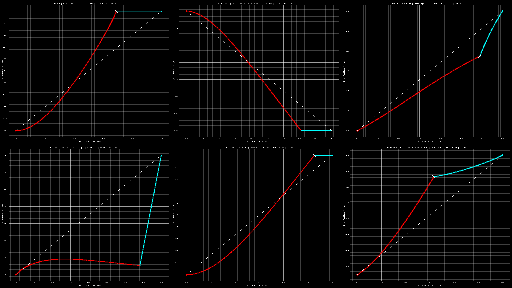
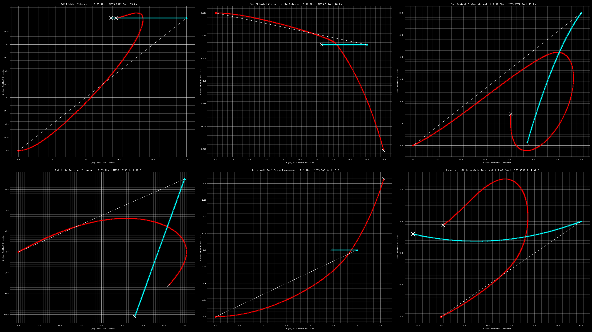
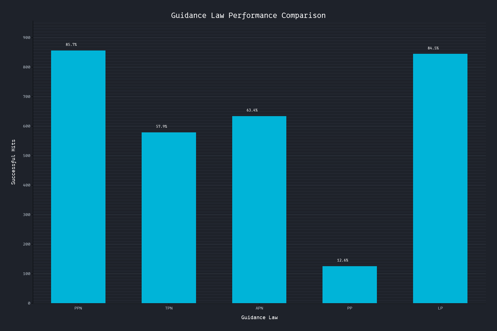
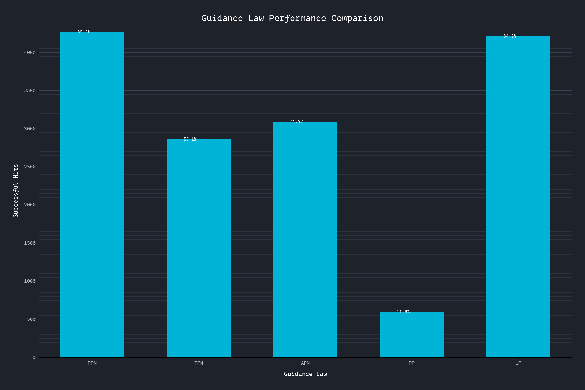
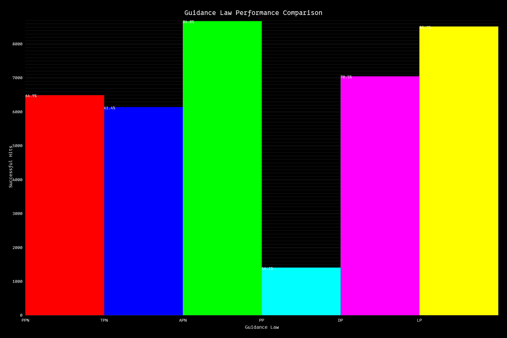

## Missile-Sim

A missile guidance system simulator supporting multiple guidance laws in 3D combat scenarios.
This lib enables exploration of proportional navigation dynamics through realistic simulations with trajectory
plots, performance metrics, and machine learning dataset generation.

### Guidance Laws

This simulator implements six different guidance laws:

- **Pure Proportional Navigation (PPN)**: Classical guidance using line-of-sight rate
    - `a_c = N × V_m × λ̇`
    - N = Navigation constant (typically 3-5)

- **True Proportional Navigation (TPN)**: Accounts for closing speed in addition to LOS rate
    - `a_c = N × V_c × λ̇`
    - V_c = Closing velocity

- **Augmented Proportional Navigation (APN)**: Adds target acceleration compensation
    - `a_c = N × V_c × λ̇ + (N/2) × a_t`
    - a_t = Target acceleration (estimated)

- **Pure Pursuit (PP)**: Aims directly at target's current position
    - Simple pursuit strategy, often inefficient against maneuvering targets

- **Deviated Pursuit (DP)**: Pursuit with deviation angle correction
    - Improved pursuit with angular correction

- **Lead Pursuit (LP)**: Aims ahead of target with configurable lead factor
    - `a_c = K × (target_predicted_pos - missile_pos)`
    - K = Lead factor

### Example Usage

```rust
use missile_sim::prelude::*;

fn main() {
    let scenario = Scenario::builder("Head-on-intercept")
        .missile(Missile {
            state: State3D {
                position: Vector3::new(0.0, 0.0, 0.0),
                velocity: Vector3::new(100.0, 0.0, 0.0),
            },
            max_acceleration: 30.0,
            navigation_constant: 3.0,
            max_closing_speed: 1000.0,
        })
        .target(Target {
            state: State3D {
                position: Vector3::new(1000.0, 0.0, 0.0),
                velocity: Vector3::new(0.0, 0.0, 0.0),
            },
            acceleration: Vector3::zeros(),
        })
        .dt(0.01)
        .total_time(20.0)
        .hit_threshold(5.0)
        .build()
        .expect("Failed to build scenario");

    let metrics = scenario.simulate(&PureProportionalNavigation);
    println!("Scenario: {}", scenario.name);
    println!("Result:   {}", metrics.console_summary());
    println!("Steps:    {}", metrics.time_history.len());
    println!();
}
```

Checkout [examples](./examples) for more detailed example scenarios and performance comparisons across guidance laws.

### Scenarios plot

These plot showcase the trajectories between `'dumb'` homing missiles and `'smart'` guidance missile



### Performance Metrics



- PP: 14.2% hit rate (142 hits)
- TPN: 63.6% hit rate (636 hits)
- APN: 88.0% hit rate (880 hits)
- PPN: 66.7% hit rate (667 hits)
- DP: 71.8% hit rate (718 hits)
- LP: 86.2% hit rate (862 hits)



- TPN: 61.7% hit rate (3087 hits)
- PPN: 65.1% hit rate (3255 hits)
- PP: 14.1% hit rate (704 hits)
- APN: 86.9% hit rate (4344 hits)
- DP: 70.8% hit rate (3538 hits)
- LP: 85.2% hit rate (4260 hits)



- APN: 86.8% hit rate (8676 hits)
- TPN: 61.4% hit rate (6139 hits)
- PP: 14.1% hit rate (1407 hits)
- PPN: 64.9% hit rate (6490 hits)
- LP: 85.1% hit rate (8514 hits)
- DP: 70.5% hit rate (7047 hits)