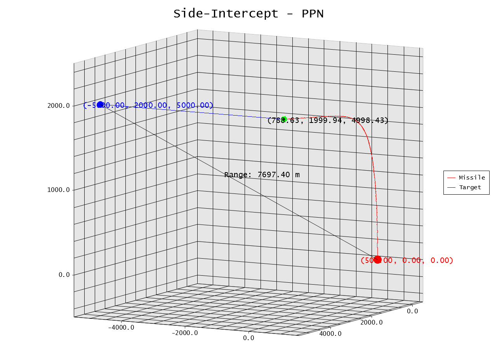
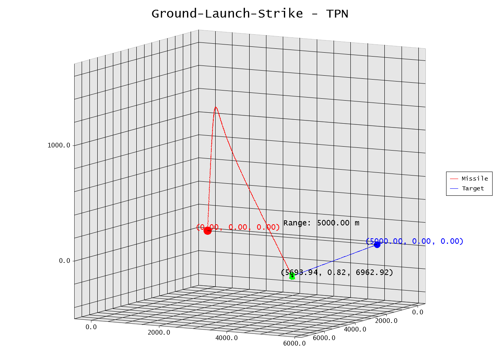

## Missile-Sim

A missile guidance system simulator supporting multiple guidance laws in 3D combat scenarios.
This lib enables exploration of proportional navigation dynamics through realistic simulations with trajectory
plots, performance metrics, and machine learning dataset generation.

### Guidance Laws

This simulator implements six different guidance laws:

- **Pure Proportional Navigation (PPN)**: Classical guidance using line-of-sight rate
    - `a_c = N × V_m × λ̇`
    - N = Navigation constant (typically 3-5)

- **True Proportional Navigation (TPN)**: Accounts for closing speed in addition to LOS rate
    - `a_c = N × V_c × λ̇`
    - V_c = Closing velocity

- **Augmented Proportional Navigation (APN)**: Adds target acceleration compensation
    - `a_c = N × V_c × λ̇ + (N/2) × a_t`
    - a_t = Target acceleration (estimated)

- **Pure Pursuit (PP)**: Aims directly at target's current position
    - Simple pursuit strategy, often inefficient against maneuvering targets

- **Deviated Pursuit (DP)**: Pursuit with deviation angle correction
    - Improved pursuit with angular correction

- **Lead Pursuit (LP)**: Aims ahead of target with configurable lead factor
    - `a_c = K × (target_predicted_pos - missile_pos)`
    - K = Lead factor

### Example Usage

```rust
use missile_sim::prelude::*;
fn main() {
    let scenario = Scenario::builder("Head-on-intercept")
        .missile_config(MissileConfig {
            position: Vector3::new(0.0, 0.0, 0.0),
            velocity: Vector3::new(100.0, 0.0, 0.0),
            max_acceleration: 30.0,
            navigation_constant: 3.0,
            max_closing_speed: 1000.0,
        })
        .target_config(TargetConfig {
            position: Vector3::new(1000.0, 0.0, 0.0),
            velocity: Vector3::new(0.0, 0.0, 0.0),
            acceleration: Vector3::zeros(),
        })
        .dt(0.01)
        .total_time(20.0)
        .hit_threshold(5.0)
        .build()
        .unwrap();

    let metrics = scenario.simulate(&PureProportionalNavigation);
    println!("Scenario: {}", scenario.name);
    println!("Result:   {}", metrics.console_summary());
    println!("Steps:    {}", metrics.time_history.len());
    println!();
}
```

Checkout the `examples` directory for more detailed example scenarios and performance comparisons across guidance laws.

### Example Scenarios

```rust
async fn scene_0() -> Result<Scenario> {
    ScenarioBuilder::new("Perpendicular-Intercept")
        .missile_config(MissileConfig {
            position: Vector3::new(500.0, 0.0, 0.0),
            velocity: Vector3::new(0.0, 1250.0, 0.0),
            max_acceleration: 1500.0,
            navigation_constant: 5.0,
            max_closing_speed: 8000.0,
        })
        .target_config(TargetConfig {
            position: Vector3::new(-5000.0, 2000.0, 0.0),
            velocity: Vector3::new(1200.0, 0.0, 0.0),
        })
        .dt(0.00001)
        .total_time(60.0)
        .hit_threshold(10.0)
        .build()
}

async fn scene_1() -> Result<Scenario> {
    ScenarioBuilder::new("Ground-Launch-Strike")
        .missile_config(MissileConfig {
            position: Vector3::new(0.0, 0.0, 0.0),
            velocity: Vector3::new(500.0, 1000.0, 800.0),
            max_acceleration: 2500.0,
            navigation_constant: 8.0,
            max_closing_speed: 8500.0,
        })
        .target_config(TargetConfig {
            position: Vector3::new(5000.0, 0.0, 0.0),
            velocity: Vector3::new(100.0, 0.0, 1000.0),
        })
        .dt(0.00001)
        .total_time(60.0)
        .hit_threshold(10.0)
        .build()
}

async fn scene_2() -> Result<Scenario> {
    ScenarioBuilder::new("Air-Strike")
        .missile_config(MissileConfig {
            position: Vector3::new(-5000.0, 5000.0, 0.0),
            velocity: Vector3::new(2555.0, -1250.0, 0.0),
            max_acceleration: 4500.0,
            navigation_constant: 6.0,
            max_closing_speed: 8550.0,
        })
        .target_config(TargetConfig {
            position: Vector3::new(5000.0, 100.0, 0.0),
            velocity: Vector3::new(750.0, 0.0, 0.0),
        })
        .dt(0.00001)
        .total_time(60.0)
        .hit_threshold(10.0)
        .build()
}

async fn scene_3() -> Result<Scenario> {
    ScenarioBuilder::new("Side-Intercept")
        .missile_config(MissileConfig {
            position: Vector3::new(500.0, 0.0, 0.0),
            velocity: Vector3::new(0.0, 1250.0, 0.0), // Steep dive
            max_acceleration: 5500.0,
            navigation_constant: 8.0,
            max_closing_speed: 8000.0,
        })
        .target_config(TargetConfig {
            position: Vector3::new(-5000.0, 2000.0, 5000.0),
            velocity: Vector3::new(1200.0, 0.0, 0.0),
        })
        .dt(0.00001)
        .total_time(60.0)
        .hit_threshold(10.0)
        .build()
}
```

### Scenarios plot




### Summary Metrics


- PPN: 38.9% hit rate (389 hits)
- TPN: 31.0% hit rate (310 hits)
- APN: 51.9% hit rate (519 hits)
- PP: 73.8% hit rate (738 hits)
- DP: 67.0% hit rate (670 hits)
- LP: 85.6% hit rate (856 hits)


- PPN: 40.0% hit rate (2000 hits)
- TPN: 32.1% hit rate (1606 hits)
- APN: 52.9% hit rate (2648 hits)
- PP: 74.8% hit rate (3741 hits)
- DP: 68.2% hit rate (3411 hits)
- LP: 85.6% hit rate (4279 hits)


- PPN: 40.3% hit rate (4031 hits)
- TPN: 32.2% hit rate (3217 hits)
- APN: 54.1% hit rate (5412 hits)
- PP: 74.7% hit rate (7473 hits)
- DP: 68.4% hit rate (6835 hits)
- LP: 85.5% hit rate (8552 hits)